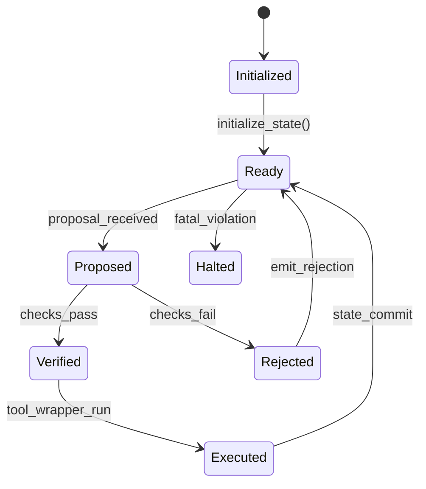

# System Architecture

## Overview
Verifiable Agent Core (VAC) is a deterministic execution boundary for AI agents. The system enforces a strict **Propose → Verify → Execute** flow for every side-effectful operation.

## Core State Machine Diagram

## Execution Flow: Propose → Verify → Execute
1. **Propose**: Untrusted planner/orchestrator submits typed proposal.
2. **Verify**: Core validates schema, policy constraints, budgets, and temporal obligations.
3. **Execute**: Wrapped tool is invoked only if verification succeeds; state and trace are atomically updated.

## Component Breakdown
### 1. Core Engine
- Owns canonical state.
- Implements deterministic `step()` transition.
- Coordinates validation, monitoring, execution, and reporting.

### 2. Spec Compiler
- Parses DSL rules.
- Type-checks and normalizes constraints.
- Compiles to executable predicates and SMT formulas.

### 3. SMT Layer
- Encodes action/state obligations into solver constraints.
- Produces SAT/UNSAT decision and model/counterexample.
- Supports bounded model checking queries.

### 4. Runtime Monitor
- Consumes append-only trace stream.
- Evaluates temporal properties incrementally.
- Emits violations for halt/escalation.

### 5. Tool Wrappers
- Enforce registration, schema validation, and permission checks.
- Apply preconditions/postconditions.
- Meter cost and side effects for budget accounting.

## Trust Boundaries
- **Untrusted**: LLM output, orchestration plans, external APIs.
- **Trusted**: VAC core, spec compiler, solver invocation policy, wrapper enforcement.
- **Conditionally trusted**: Tool runtime and external systems, guarded by wrappers and postconditions.

## Threat Model Summary
- Prevent unauthorized tool execution.
- Prevent state corruption or policy bypass.
- Mitigate prompt-injection-triggered side effects.
- Detect temporal safety violations in long-running traces.
- Preserve auditability through deterministic replay artifacts.
